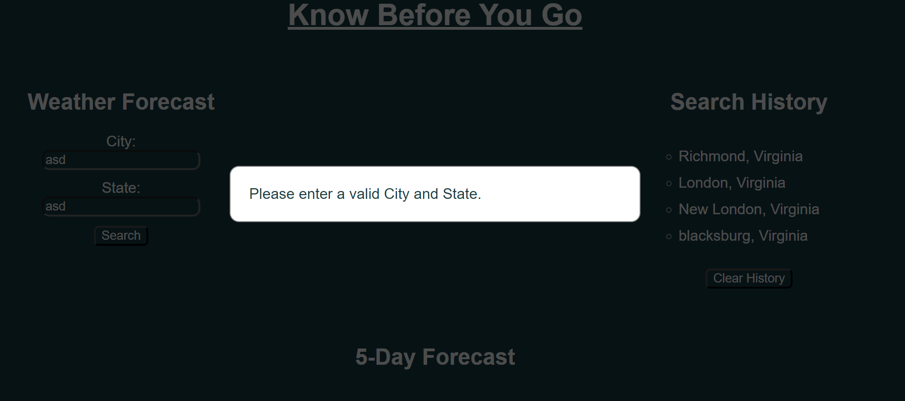

# Know-Before-You-Go

A weather forecast website that displays a 5-day forecast for a city that the user inputs. It then saves that city to a history aside and within local storage.

## User Story

We were prompted this week to produce a website that uses a given API to fetch a 5-day forecast. There was no starter code for this challenge so we needed to create the HTML, CSS, and JS from scratch.

The requirements were:

- To allow the user to enter a city to inquire about the weather.
  - I added the state option as well since there are many cities within the U.S that share names.
- Save the cities in a 'Search History' section on the page. As well as within the local storage.
- Then to display the 5-day forecast on the page.
  - This section was to show a weather emoji (like clouds, sun, rain, etc.), the wind speed, temperature, and humidity.
  - The API automatically displays temperature in Kelving and wind speed in m/s and I decided to make my site a scientific forecast and left these units.

## Additions

I added a modal if the City or State are invalid. It appears with a simple message stating 'Please enter a valid City and State.'. You can then just click anywhere off the modal to make it dissapear.

### Screenshot of the local site on Live Server:

### Links:

Link to Github:
https://github.com/anplace/Know-Before-You-Go

Link to Live Site:
https://anplace.github.io/Know-Before-You-Go/
